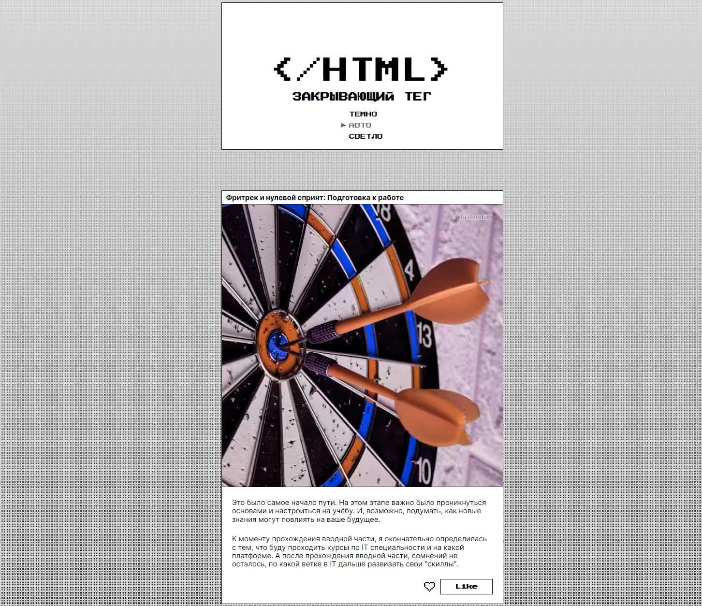

# Закрывающий тег
Закрывающий тег — проект про рефлексию в середине пройденного мной пути на курсе frontend-разработчик. В каждую из восьми карточек подобрана картинка, лейбл и написан небольшой личный текст (см. второй абзац), под каждый изученный спринт обучения.  

---
## Обзор проекта

DEMO Закрывающий тег

  

 Ссылка на макет [Figma](https://www.figma.com/design/wlEuATONOV9beiWvy77RIx/).

---
## Было сделано:
- Используется вариативный шрифт: Inter.
- Переключение цветовых схем. Поддерживаемые цветовые схемы описаны в метатеге <meta name="color-scheme" content="dark light">;
- На сайте адаптивный svg-фавикон. Стили прямо внутри него. Значение fill у кривых изменяется в зависимости от темы.
- На странице фиксированное фоновое изображение реализовано через background-color и background-image, с использованием градиента фона в CSS;
- Анимация стрелки в меню, кнопок Like и «Сохранить на память. У всех кнопок анимация и изменения цветов текста определены свойством mix-blend-mode.
- Реализована анимация  SVG с сердцем — иконки, с именованными через классы группами и path. 
- На странице отображается не менее восьми карточек:
  - в каждой карточке отображается лейбл.
  - картинки карточек стилизованы CSS-фильтрами.
- Реализовано модальное окно на странице, с помощью элемента dialog.
- Все интерактивные элементы имеют состояния hover и focus-visible.
---
## Стек
HTML, CSS, JavaScript

